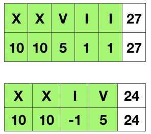

## 通俗易懂型

特殊用例-字符串替换，再从左到右一般累加求解：

```cpp
class Solution {
    public int romanToInt(String s) {
        s = s.replace("IV","a");
        s = s.replace("IX","b");
        s = s.replace("XL","c");
        s = s.replace("XC","d");
        s = s.replace("CD","e");
        s = s.replace("CM","f");
        
        int result = 0;
        for (int i=0; i<s.length(); i++) {
            result += which(s.charAt(i));
        }
        return result;
    }

    public int which(char ch) {
        switch(ch) {
            case 'I': return 1;
            case 'V': return 5;
            case 'X': return 10;
            case 'L': return 50;
            case 'C': return 100;
            case 'D': return 500;
            case 'M': return 1000;
            case 'a': return 4;
            case 'b': return 9;
            case 'c': return 40;
            case 'd': return 90;
            case 'e': return 400;
            case 'f': return 900;
        }
        return 0;
    }
}
```

## 贴近原理型



小值在左，做减法；
小值在右，做加法。

```cpp
class Solution {
private:
    unordered_map<char, int> symbolValues = {
        {'I', 1},
        {'V', 5},
        {'X', 10},
        {'L', 50},
        {'C', 100},
        {'D', 500},
        {'M', 1000},
    };

public:
    int romanToInt(string s) {
        int ans = 0;
        int n = s.length();
        for (int i = 0; i < n; ++i) {
            int value = symbolValues[s[i]];
            if (i < n -1 && value < symbolValues[s[i+1]]) {
                ans -= value;
            } else {
                ans += value;
            }
        }

        return ans;
    }
};
```
