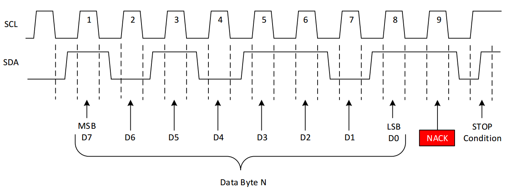

### IIC如何发送一个数据？  
IIC（Inter-Integrated Circuit）是一种两线式串行通信协议，发送数据的基本流程如下：  
1. **起始信号（S）**：主机拉低SDA线（数据），同时SCL线（时钟）保持高电平，产生起始信号，宣告通信开始。  
2. **发送从机地址+读写位**：主机通过SDA线发送7位从机地址，第8位为读写位（0表示写，1表示读），每发送1位，SCL线产生一个时钟脉冲（高电平期间数据有效）。  
3. **等待从机应答（ACK）**：从机收到地址后，若匹配则拉低SDA线，在第9个时钟脉冲时产生应答信号。  
4. **发送数据**：主机连续发送8位数据，每bit对应一个SCL时钟脉冲，从机在每个字节后返回应答信号（ACK）。  
5. **停止信号（P）**：数据发送完成后，主机拉高SCL线，再拉高SDA线，产生停止信号，结束通信。  

### IIC时序图（简化版）  

### 常见IIC芯片  
- **传感器**：温湿度传感器（如SHT30、AHT20）、加速度传感器（如MPU6050）。  
- **存储芯片**：EEPROM（如AT24C02、AT24C128）。  
- **显示驱动**：OLED屏驱动芯片（如SSD1306）。  
- **电源管理**：电源监控芯片（如TPS65910）。  
- **音频芯片**：音频 codec（如WM8731）。