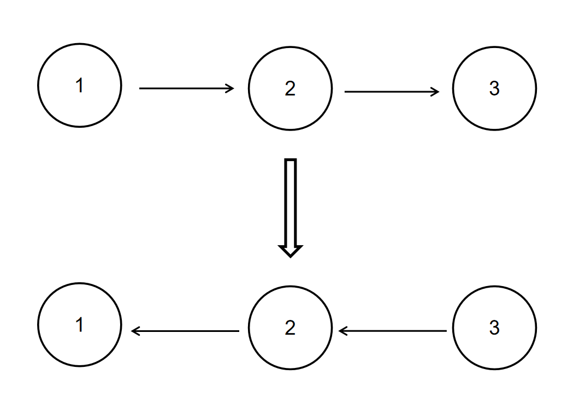

# 反转链表

描述

给定一个单链表的头结点pHead(该头节点是有值的，比如在下图，它的val是1)，长度为n，反转该链表后，返回新链表的表头。

数据范围： 0≤n≤1000

要求：空间复杂度O(1) ，时间复杂度 O(n) 。

如当输入链表{1,2,3}时，经反转后，原链表变为{3,2,1}，所以对应的输出为{3,2,1}。

以上转换过程如下图所示：

示例1

输入：{1,2,3}

返回值： {3,2,1}

示例2

输入： {}

返回值： {}

说明：空链表则输出空